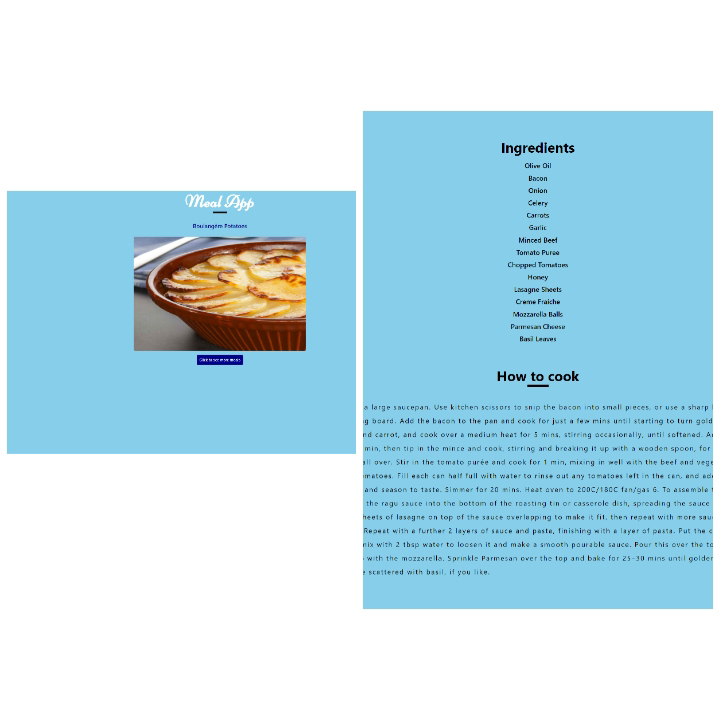

  
  <h1>Meal Generator App</h1>

<!-- TABLE OF CONTENTS -->

  
Table of Contents

  <ol>
    <li>
      <a href="#about-the-project">About The Project</a>
      <ul>
          <li><a href="#built-with">Built With</a></li>
          <li><a href="#getting-started">Getting Started</a></li>
          <li><a href="#Available Script">Available Script</a></li>
         </ul>
    </li>      
  </ol>

## About The Project

<!-- [![Product Name Screen Shot][product-screenshot]](https://example.com) -->

Repo_name: https://github.com/ijayhub/meal-app

Hosted link: 

project_title: Meal generator app

project_description: This website generates meal randomly and shows ingredients and how it prepared.

(<a href="#top">back to top</a>)

### Built With

* [React](https://reactjs.org/)
* [Api](https://www.themealdb.com/api.php)

(<a href="#top">back to top</a>)

## Getting Started

To get a local copy up and running follow these simple example steps:
## Available Script

In the project directory, you  Create-react-app.
To view on your browser you run:

 ### `npm start`

Runs the app in the development mode.\
Open [http://localhost:3000](http://localhost:3000) to view it in your browser.

The page will reload when you make changes.\
You may also see any lint errors in the console.

To route to another page you install npm install react-router-dom@6

< align="right">(<a href="#top">back to top</a>)</